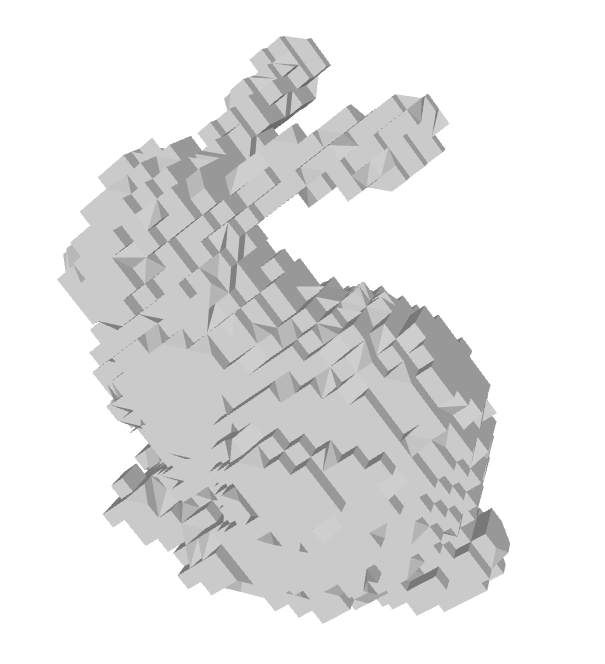
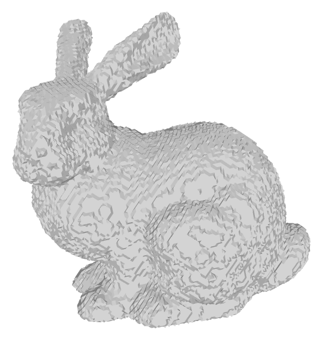
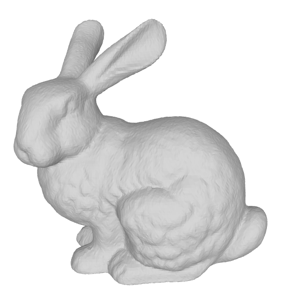

# TP - Codage et Compression 3D - GERARDIN Dorian

_Dans le dossier "images", on peut retrouver plusieurs images du bunny.off quantifié selon différents facteurs_
_Dans le dossier "quant_deq", on peut retrouver les fichiers des bunny.off quantifiés puis déquantifiés selon différents facteurs_

## Question 1 :

### - Quantification : 
_Voir dans le code la fonction_ 
```c++ 
std::vector<glm::vec3> quantification(std::vector<glm::vec3> vertices, int qp) 
```
Cette fonction prend en paramètre un tableau de vertices ainsi qu'un facteur de quantification.
Elle retourne un tableau de vertices quantifié en fonction du facteur de quantification passé en paramètre.

Voici quelques exemples de quantifications : 

Q = 5           |           Q = 7           |            Q = 10
:-------------------------:|:-------------------------:|:-------------------------:
   | | 

### - Déquantification : 
_Voir dans le code la fonction_ 
```c++ 
std::vector<glm::vec3> dequantification(std::vector<glm::vec3> verticesWithoutQ, std::vector<glm::vec3> vertices, int qp)
```
Cette fonction prend en paramètre le tableau des vertices non quantifiés, le tableau des vertices quantifiés ainsi qu'un facteur de quantification.
Elle retourne un tableau de vertices déquantifié en fonction du facteur de quantification passé en paramètre.

## Question 2 :

_Voir dans le code la fonction_ 
```c++ 
float RMSE(std::vector<glm::vec3> vertices, std::vector<glm::vec3> verticesQ) 
```
La courbe du RMSE en fonction du facteur de quantification :


On observe que plus le facteur de quantification est faible, plus nous avons un écart quadratique moyen.

## Question 3 :

J'ai bien implémenté les fonctions d'encodage et de décodage de rANS sur les maillages quantifiés, cependant avec le nombre de vertices très important des maillages, nous depassons le seuil maximal autorisé pour les des entiers.
Ainsi pour bien vérifier la fonctionnalité de l'encodage et du décodage de rANS, je les ai testé sur l'exemple du cours.

### - Encodage :

On a donc les fonctions :

```c++
std::vector<int> createSequence(std::vector<glm::vec3> vertices)
```
_Cette fonction créée une séquence selon les vertices passés en paramètre_

```c++
std::vector<int> createAlphabet(std::vector<int> sequence)
```
_Cette fonction créée un alphabet selon une séquence passé en paramètre_

```c++
std::vector<int> createFrequence(std::vector<int> sequence, std::vector<int> alphabet)
```
_Cette fonction créée un ensemble de fréquence selon une séquence et un alphabet passés en paramètre_

```c++
int encode_rANS(std::vector<int> alphabet, std::vector<int> sequence, std::vector<int> frequence)
```
_Cette fonction fait l'encodage rANS selon l'alphabet, la séquence et les fréquences passés en paramètre_

Pour la séquence suivante : { 0,1,0,2,2,0 }
On obtient bien l'encodage : 139.


### - Décodage :

On a donc les fonctions :

```c++
int getFrequenceSize(std::vector<int> frequence)
```
_Cette fonction retourne la somme des fréquences passées en paramètre_

```c++
std::vector<int> getFrequenceCumulative(std::vector<int> frequence)
```
_Cette fonction retourne l'ensemble des fréquences cumulatives pour les fréquences passées en paramètre_

```c++
int freqCumulInv(int x, std::vector<int> freqCumul)
```
_Cette fonction retourne l'indice de la fréquence selon un slot passé en paramètre_


```c++
std::vector<int> decode_rANS(int encode, std::vector<int> frequence)
```
_Cette fonction fait le decodage rANS selon les fréquences et la valeur d'encodage passées en paramètre_

Pour l'encodage passé en paramètre on a ce déroulement : 

```bash
encode : 139
Xt : 139
Slot : 1
St : 0
Xt = floor(139/6)*3 + (139%6) - 0
70 = 23*3 + (1) - 0

Xt : 70
Slot : 4
St : 2
Xt = floor(70/6)*2 + (70%6) - 4
22 = 11*2 + (4) - 4

Xt : 22
Slot : 4
St : 2
Xt = floor(22/6)*2 + (22%6) - 4
6 = 3*2 + (4) - 4

Xt : 6
Slot : 0
St : 0
Xt = floor(6/6)*3 + (6%6) - 0
3 = 1*3 + (0) - 0

Xt : 3
Slot : 3
St : 1
Xt = floor(3/6)*1 + (3%6) - 3
0 = 0*1 + (3) - 3

Xt : 0
Slot : 0
St : 0
Xt = floor(0/6)*3 + (0%6) - 0
0 = 0*3 + (0) - 0

Sequence : { 0 1 0 2 2 0 }
```

On retrouve bien la bonne séquence.

Je n'ai pas trop compris ce qu'il fallait faire pour le taux de compression sachant qu'après quantification les fichiers _*.off_ fonct toujours la même taille. Et après encodage et/ou décodage nous n'avons qu'un entier accompagné d'un ensemble de fréquence.
